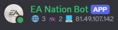
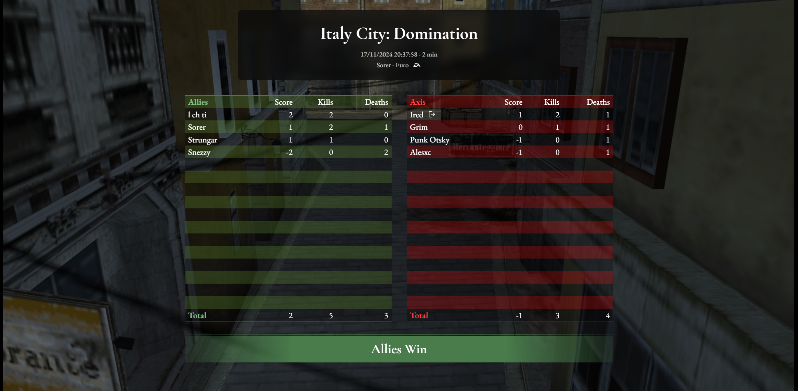
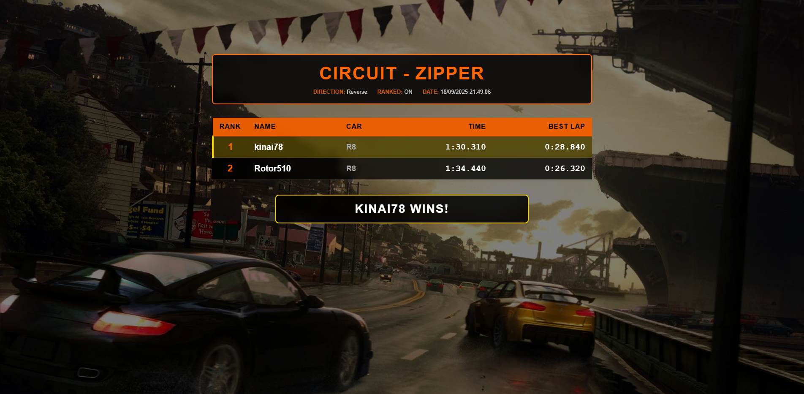
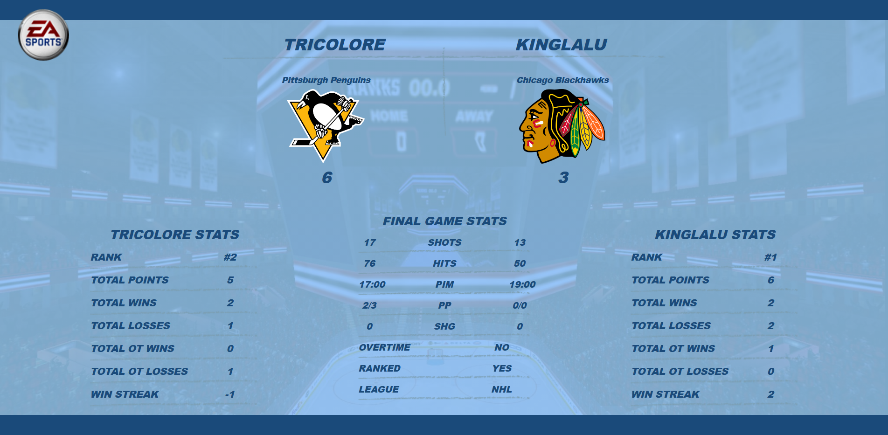

# EA Nation Server

An emulator of the EA Nation server based on the Aries protocol.

This project is a continuation of the [mohh-master-server](https://github.com/a-blondel/mohh-master-server), as the
scope of the project has been extended to support more games.

## Discord

[](https://discord.gg/fwrQHHxrQQ)

It is used to :

- Talk about the games
- Share technical knowledge
- Regroup the community and organize events

Fell free to join !

## Supported games

| Game                              | Platform(s)     | Region(s) | Status                        |
|-----------------------------------|-----------------|-----------|-------------------------------|
| UEFA Champions League 2006-2007   | PSP             | EU, US    | Playable, partial support     |
| FIFA 07, 08                       | PS2             | EU        | Playable, partial support     |
| FIFA 07, 08, 09, 10               | PSP             | EU, US    | Playable, partial support     |
| FIFA World Cup Germany 2006       | PSP             | EU, US    | Playable, partial support     |
| FIFA World Cup South Africa 2010  | PSP             | EU, US    | Playable, partial support     |
| Fight Night Round 3               | PSP             | EU, US    | Playable, partial support     |
| MADDEN 07, 08, 09, 10             | PSP             | EU, US    | Playable, partial support     |
| Medal of Honor: Heroes            | PSP             | EU, US    | Full support                  |
| Medal of Honor: Heroes 2          | PSP, Wii        | EU, US    | In progress, not playable yet |
| Need for Speed: Most Wanted 2005  | PC, PS2 (Alpha) | EU, US    | Playable, partial support     |
| Need for Speed: Most Wanted 5-1-0 | PSP             | EU, US    | Full support                  |
| Need for Speed Carbon: OTC        | PSP             | EU, US    | Full support                  |
| Need for Speed: ProStreet         | PSP             | EU, US    | Full support                  |
| Need for Speed: Undercover        | PSP             | EU, US    | Full support                  |
| NBA Live 06, 07, 08               | PSP             | US        | Playable, partial support     |
| NCAA 07                           | PSP             | US        | Playable, partial support     |
| NHL 07                            | PSP             | EU, US    | Playable, partial support     |
| Tiger Woods PGA Tour 07, 08, 10   | PSP             | EU, US    | Playable, partial support     |

Notes:

- **FIFA WC 06, Fight Night Round 3, NFS MW 2005/5-1-0 and NBA Live 06 requires
  the [SSLv2 stunnel](https://github.com/a-blondel/ea-sslv2-stunnel) to connect**
- **The EU version of NFS MW 5-1-0 requires
  an [SSL bypass patch](https://github.com/a-blondel/ea-nation-patches/tree/main/PSP/Xdelta/NFS-Most-Wanted) to
  connect, as the game's port is already used by NFS Undercover**
- **The only supported PS2 version of NFS MW 2005 is the `Alpha 124` (a.k.a. `Sep 20, 2005 prototype`), as the online
  feature was cut from the Beta & Release on PS2**
- **The PS2 version of NFS MW 2005 requires a DNAS patch. Either
  use [DNAS-net Patcher](https://www.psx-place.com/threads/dnas-net-patcher.22813/) or the
  provided [Xdelta patch](https://github.com/a-blondel/ea-nation-patches/tree/main/PS2/Xdelta/NFS-Most-Wanted)**
- All the other PS2 games requires a DNAS patch unless they are supported by DNASrep.
  See [pnach](https://github.com/a-blondel/ea-nation-patches/tree/main/PS2/pnach) folder for your specific game
- Partial support means that some features are not implemented yet, like:
    - Leaderboards
    - Roster download
    - Interactive league

## Development Status

You can follow the progress on the [project board](https://github.com/users/a-blondel/projects/2/views/1)

## Contribute (for developers)

Everything to know is in the [Wiki](https://github.com/a-blondel/ea-nation-server/wiki)  
It contains :

- Development requirements
- How to run the server
- Project architecture
- Database description
- How to add game servers dynamically
- Technical knowledge about EA Nation server (TCP packets)

## Credits

In addition to the [contributors](https://github.com/a-blondel/ea-nation-server/graphs/contributors) of this project and
the [contributors of mohh-master-server](https://github.com/a-blondel/mohh-master-server/graphs/contributors), the
following projects were inspiring in the development of this project:

- EA SSL certificate vulnerability
    - https://github.com/Aim4kill/Bug_OldProtoSSL (analysis)
    - https://github.com/valters-tomsons/arcadia (implementation)
- Nintendo WFC server emulator
    - https://github.com/barronwaffles/dwc_network_server_emulator
- Related EA server emulators with more or less similar TCP packets
    - https://github.com/HarpyWar/nfsuserver
    - https://github.com/VTSTech/VTSTech-SRVEmu
    - https://github.com/nleiten/ea-server-emu-startpoint
    - https://gitlab.com/gh0stl1ne/eaps

# EA Nation Discord Bot

## Features

- Discord bot activity
    - Current connected player count
    - Current in game player count
    - Current DNS IP Address
- Scoreboards
    - Sends an image of the scoreboard every time a game ends
- Events
    - Sends a message when players connect/disconnect and join/leave games

<br/>
*Discord bot activity*

<br/>
*MoHH Scoreboard*

<br/>
*NFS Scoreboard*

<br/>
*NHL Scoreboard*

## Run

In IntelliJ IDEA, create a new `Application` run configuration.

To start with the `dev` profile (containing database samples), use the following command line argument:

```
-Dspring.profiles.active=dev
```

For the Discord bot to work, you need to define the appropriate environment variables :

- `DNS_NAME` : the DNS name of the server
- `DISCORD_TOKEN` : the token of the Discord bot

Otherwise, comment out the `DiscordBotService` methods.

If you don't want to use the `dev` profile, you have to define the following environment variables :

- `DB_URL` : the URL of the database
- `DB_USERNAME` : the username of the database
- `DB_PASSWORD` : the password of the database

But this requires to run an [EA Nation Server](https://github.com/a-blondel/ea-nation-server) database locally.

The default scoreboard image is generated in the `report` directory. You can change the path using the `REPORTS_PATH`
environment variable.  

